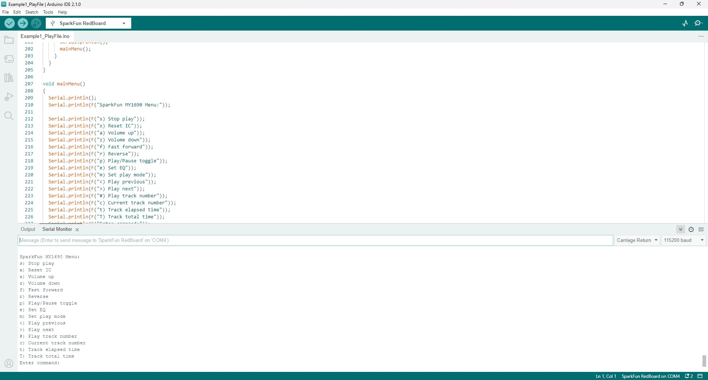

The SparkFun MY1690 MP3 Decoder Arduino library includes three examples to demonstrate how to use the library. Let's take a closer look at these examples.

## Example 1 - Play File

The first example plays the first audio track stored on a connected SD card once through and stops. In Arduino, open the example by navigating to **File** > **Examples** > **SparkFun MY1690X MP3 Decoder Arduino Library** > **Example1_PlayFile**. Select the **Board** and **Port** and click "Upload". Once upload finishes, the code will automatically start by playing the first track stored on the SD card so make sure to have headphones/speakers connected to hear the audio as it does not repeat. You can push the Reset button on the shield to reset the board and start the code over to hear the track play again.

The code does have some serial printouts to help troubleshoot if the code hangs on attempting to initialize the MY1690X or when checking the SD card for audio tracks. If you have any issues with playback, open the [serial monitor](https://docs.arduino.cc/software/ide-v2/tutorials/ide-v2-serial-monitor/) with the baud set to **115200** to view the serial prints from the code.

## Example 2 - Kitchen Sink

The second example demonstrates how to use all of the available commands on the MY1690X to control and manipulate audio tracks through a serial menu. Open the example by navigating to **File** > **Examples** > **SparkFun MY1690X MP3 Decoder Arduino Library** > **Example2_KitchenSink**. Select the **Board** and **Port** and click "Upload". After the code finishes uploading, open the serial monitor with the baud set to **115200** and you should see a menu like the screenshot below:

[{ width="600"}](./assets/img/Example1_Screenshot.jpg)

The MY1690 Menu has options for all the available playback and settings commands for the MY1690X. Some like "Play" or "Reverse" are straightforward and perform the expected action. The options for setting the equalizer (Set EQ) and play mode (Set Play Mode) cycle through the available options for these settings and print out the matching number. The Equalizer and Play modes are listed below and can be found in the instruction list in section 6.1 of the [MY1690X datasheet](./assets/component_documentation/MY1690X‑16S%20MP3%20Decoder%20IC%20User%20Manual.pdf):

**Equalizer Modes**

* 0 - None
* 1 - Pop
* 2 - Rock
* 3 - Jazz
* 4 - Classic
* 5 - Bass

**Play Modes**

* 0 - Full
* 1 - Folder
* 2 - Single
* 3 - Random
* 4 - No Loop

## Example 3 - Kitchen Sink ESP32

Example 3 - Kitchen Sink ESP32 is nearly identical to Example 2 but is modified to work with ESP32-based development boards like the [SparkFun IoT RedBoard - ESP32](https://www.sparkfun.com/sparkfun-iot-redboard-esp32-development-board.html). Open the example by navigating to **File** > **Examples** > **SparkFun MY1690X MP3 Decoder Arduino Library** > **Example2_KitchenSink**. Select the **Board** (SparkFun IoT RedBoard - ESP32 or other ESP32 dev board) and **Port** and click "Upload". After the code finishes uploading, open the serial monitor with the baud set to **115200** to view the same serial menu as pictured above.