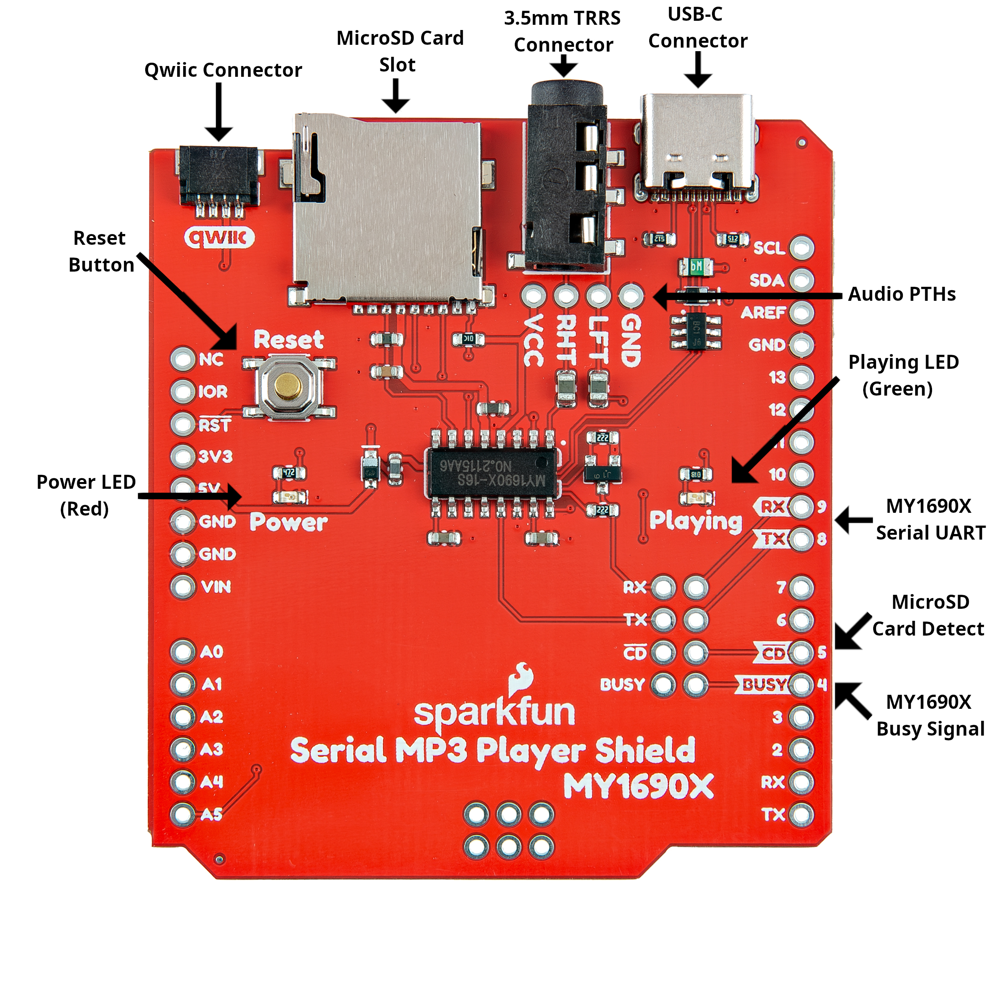
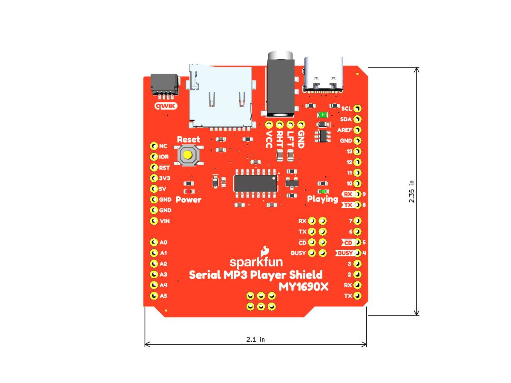

Let's take a closer look at the SparkFun Serial MP3 Player Shield - MY1690X and the hardware present on the board. The photo below highlights the major components on this shield that we'll cover in more detail in this section:

[{ width="600"}](./assets/img/Serial_MP3_Player_Shield-Annotated.jpg "Click to enlarge")

## MY1690X MP3 Decoder IC

The MY1690X is an MP3 decoder IC that works with both MP3 and WAV audio files stored on a connected &micro;SD card. The MY1690X can function both as a removable USB drive when connected over USB to load, view or edit files on the SD card. The IC operates over a serial-UART interface at 3.3V TTL using a command set to control audio playback (Play, Pause, Next, etc.), volume and equalizer settings and query statuses (SD card contents, track name/length, etc.). It supports audio files with sampling rates between 8 and 48k with bit rates between 8 and 320Kbps.

## Connectors

The Serial MP3 Player Shield has three connectors. A USB-C connector, Qwiic connector and 3.5mm TRRS connector.

### USB-C

The USB-C connector on the shield connects directly to the MY1690X to mount it as a removable USB drive when a microSD card is inserted and the board is plugged into a computer. This allows you to directly add and remove audio files to a connected microSD card. This works great for small audio files but in our testing we found the transfer speed is quite slow and can take several minutes to upload larger audio files. We recommend uploading large files using a USB SD card reader or directly connecting your SD card to your computer.

When connected over USB-C (and with a microSD card plugged in) the MY1690X will stay in USB drive "mode" until a power cycle. The MY1690X does not have a Reset line so either unplug the board or press the RESET button on the shield to cycle power.

### Qwiic

The Qwiic connector on the shield lets you easily add other Qwiic devices to the board. It connects to 3.3V, Ground and both the dedicated SDA/SCL pins as well as A4 (SDA) and A5 (SCL).

### 3.5MM TRRS

The shield routes the audio output from the MY1690X to a 3.5MM TRRS audio connector as well as four 0.1"-spaced through hole pins. This allows you to easily plug in a pair of headphones directly to the shield or solder an alternate audio output. Note, the MY1690X can easily output audio for small headphones but you'll need an external amplifier on the audio output to drive larger speakers.

## MicroSD Card Slot

The shield's microSD card slot works with most standard SD cards that have up to 32GB storage space and formatted to FAT16 or FAT32. The MY1690X requires specific naming of files and folders stored on the card. Read on to the MicroSD Card Setup section of this guide for detailed information on naming conventions.

## Pinout

The Serial MP3 Player Shield matches the R4 footprint and has passthroughs for all of the pins on R4 development boards. The shield connects to the following pins on a connected Arduino dev board:

* D4 - MY1690X Busy Signal
* D5 - MY1690X Card Detect
* D8 - MY1690X TX Signal
* D9 - MY1690X RX Signal
* A4 - Qwiic SDA
* A5 - Qwiic SCL

The shield also has a 2x4 set of PTH pins near the center of the board to allow for routing the serial UART pins (RX/TX), Card Detect (CD) and Busy pins to alternate pins on a connected development board if necessary.

## LEDs

The Serial MP3 Player Shield has two LEDs labeled **PWR** and **BUSY**. The red **PWR** LED indicates whenever the board is powered. The green **BUSY** LED indicates whenever the MY1690X is playing audio.

## Reset Button

The Reset button on the shield is routed to a connected development board's reset pin to be used to reset the development board it's mounted on.

## Solder Jumpers

The shield has seven solder jumpers labeled **MIC**, **BUSY**, **PWR**, **RX**, **TX**, **CD** and **BUSY** (the two BUSY jumpers have different functions). The list below outlines each jumper's label, function, default state and any notes on how they work.

* **MIC** - The MIC jumper connects the Sleeve pin on the TRRS connector to Ground and is CLOSED by default. Open the jumper to disable this pull-down for headphones that have a built-in microphone.
* **BUSY** - The first BUSY jumper completes the Busy LED circuit and is CLOSED by default. Open the jumper to disable the Busy LED.
* **PWR** - The PWR jumper completes the Power LED circuit and is CLOSED by default. Open the jumper to disable the Power LED.
* **RX** - The RX jumper connects the MY1690X's RX pin to D9 and is CLOSED by default. Open the jumper to isolate the MY1690X's RX signal from D9 if you need to route it to another pin.
* **TX** - The TX jumper connects the MY1690X's TX pin to D9 and is CLOSED by default. Open the jumper to isolate the TX signal from D8 if you need to route it to another pin.
* **CD** - The CD jumper connects the MY1690X's Card Detect (CD) to D4 and is CLOSED by default. Open the jumper to disconnect the CD pin from D4 if you need to connect it to another pin.
* **BUSY** - The second BUSY jumper connects the MY1690X's Busy pin to D5 and is CLOSED by default. Open the jumper to disconnect the Busy pin from D5 if you need to connect it to another pin.

## Board Dimensions

The Serial MP3 Player Shield - MY1690X fits the R4 footprint and measures 2.35" x 2.1" (59.69mm x 53.34mm).

[{ width="600"}](./assets/board_files/SparkFun_Serial_MP3_Player_Shield_MY1690X.jpg "Click to enlarge")

