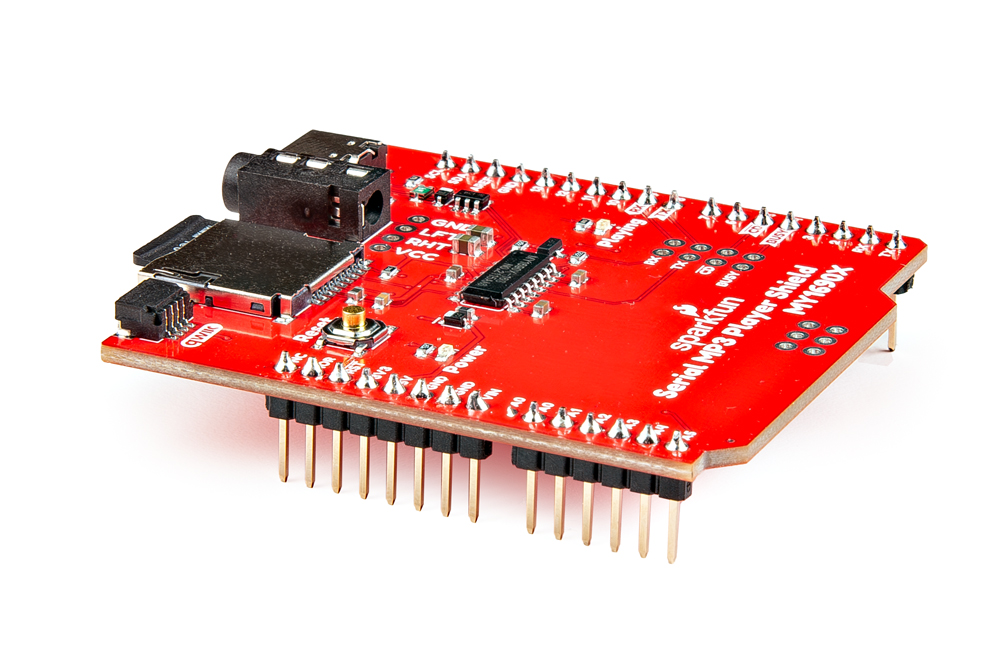
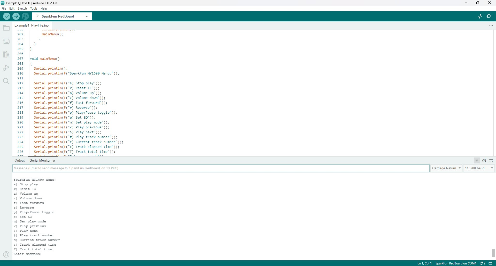

In this Quick Start guide we'll assemble the SparkFun Serial MP3 Player Shield - MY1690X, mount it to a SparkFun RedBoard Plus and use the SparkFun MY1690X MP3 Decoder Arduino Library to play audio stored on a connected microSD card. 

If you're not familiar with using Arduino shields and development boards or the Arduino IDE, refer to the [Hardware](./hardware_overview.md) & [Software](./arduino_setup.md) sections for a detailed overview of the board along with instructions on assembling the shield, installing and using the SparkFun MY1690X MP3 Decoder Arduino Library.

## Shield Assembly & Mounting

Start by soldering your selected headers to the shield so it can mount on to a compatible R4 development board. We opted for male headers here but you can use stackable headers if you'd like to stack another shield on top of this to add more functionality to your audio project:

[{ width="600"}](./assets/img/Serial_MP3_Player_Shield-Headers.jpg "Click to enlarge")

After soldering, plug the shield into your development board and connect the development board to your computer with a USB cable:

[{ width="600"}](./assets/img/Serial_MP3_Player_Shield-Assembly.jpg "Click to enlarge")

You'll also want to plug in a pair of headphones to the 3.5mm audio jack on the shield. The MY1690X can drive a pair of headphones on its own but requires an external amplifier to drive larger speakers.

## Prepare SD Card

The MY1690X works with standard SD cards up to 32GB capacity and formatted to either FAT16 or FAT32. Users can upload files to an SD card mounted on the shield by plugging it into a computer over USB-C or can load them directly onto the SD card using a USB Card Reader or the SD card slot on their computer. Files and folders on a connected SD card should match the following naming conventions:

* .MP3/.WAV files in the root directory must begin with a four digit number (eg. 000#) starting at 0001 and can have characters following the numbers
* Folders should begin with a two digit number (eg. 0#) starting at 01 and can have characters following the numbers.
* .MP3/.WAV files stored inside folders must begin with three digits (eg. 00#) starting at 001 and can have characters following the numbers.

Make sure to load the audio tracks onto the SD card and then proceed to the Arduino Example.

## Arduino Example

With the shield soldered and mounted on your Arduino dev board, let's upload Example 2 - Kitchen Sink to the board to start playing and controlling audio. This example will start playing the first track once it's uploaded and also includes a serial menu to access all of the UART commands using simple text commands. Follow the steps below to upload the example.

* Open the [Arduino IDE](https://docs.arduino.cc/software/ide-v2/tutorials/getting-started-ide-v2/).
* Open the [Library Manager](https://docs.arduino.cc/software/ide-v2/tutorials/ide-v2-installing-a-library/) tool, search for "SparkFun MY1690X MP3 Decoder" and install the latest version 
* Open "Example 2 - Kitchen Sink".
* Select your Board (SparkFun RedBoard or other R4 board) and Port and click "Upload".
* After the code compiles and finishes uploading, open the [serial monitor](https://docs.arduino.cc/software/ide-v2/tutorials/ide-v2-serial-monitor/) with the baud set to **115200**.
* The code prints out a menu of available commands to control the MY1690X's playback. Type in the command you'd like to do and hit Enter or click Send.
* Have fun playing around controlling track playback, volume and other features.

[{ width="600"}](./assets/img/Example1_Screenshot.jpg "Click to enlarge")

### Code to Note

* Serial Setup
``` c++
#include "SoftwareSerial.h"
SoftwareSerial serialMP3(8, 9); //RX on Arduino connected to TX on MY1690's, TX on Arduino connected to the MY1690's RX pin

//For boards that have multiple hardware serial ports
//HardwareSerial serialMP3(2); //Create serial port on ESP32: TX on 17, RX on 16
```
The code has options for both Software Serial and Hardware Serial depending on your dev board. The code defaults to use pins D8 and D9 for software serial

* MY1690X & Track Checks

```c++
if (myMP3.begin(serialMP3) == false) // Beginning the MP3 player requires a serial port (either hardware or software)
  {
    Serial.println(F("Device not detected. Check wiring. Freezing."));
    while (1);
  }

  int songCount = myMP3.getSongCount();
  if (songCount == 0)
  {
    Serial.println(F("Oh no! No songs found. Make sure the SD card is inserted and there are MP3s on it. Freezing."));
    while (1);
  }
```
On setup, the code checks to detect the MY1690X over serial and also checks to make sure the SD card has audio tracks 

* Get Track Numbers, MY1690 Version and Play First Track
```c++
  Serial.print(F("Number of tracks on SD card: "));
  Serial.println(songCount);

  Serial.print(F("MY1690 Version: "));
  Serial.println(myMP3.getVersion());

  myMP3.play(); //Will play the lowest numbered song in the folder
```

The example will print out the number of tracks detected on the SD card, the MY1690 version and then will play the lowest numbered song on the card. Note, it takes ~30ms for a track to start playing so the code waits 50ms before requesting play status.

* MY1690X Menu Options

This menu shows the available commands to control playback. Type in the matching character in the serial monitor and hit Enter to send it. The Set EQ and Set play mode commands cycle through the available equalizer and play mode options. Refer to the Arduino Examples section of this guide or section 6.1 of the [datasheet](./assets/component_documentation/MY1690X‑16S%20MP3%20Decoder%20IC%20User%20Manual.pdf) for more information.

```c++
void mainMenu()
{
  Serial.println();
  Serial.println(F("SparkFun MY1690 Menu:"));

  Serial.println(F("s) Stop play"));
  Serial.println(F("x) Reset IC"));
  Serial.println(F("a) Volume up"));
  Serial.println(F("z) Volume down"));
  Serial.println(F("f) Fast forward"));
  Serial.println(F("r) Reverse"));
  Serial.println(F("p) Play/Pause toggle"));
  Serial.println(F("e) Set EQ"));
  Serial.println(F("m) Set play mode"));
  Serial.println(F("<) Play previous"));
  Serial.println(F(">) Play next"));
  Serial.println(F("#) Play track number"));
  Serial.println(F("c) Current track number"));
  Serial.println(F("t) Track elapsed time"));
  Serial.println(F("T) Track total time"));
  Serial.println(F("Enter command:"));
}
```
